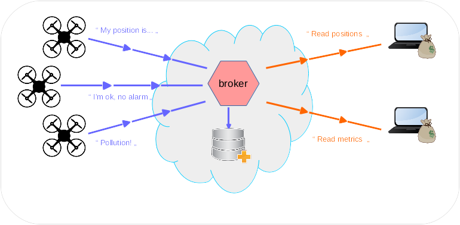

layout: true
.footer[
Connecting Things: business and architecture
]

???
---

# Connecting Things

## Business, architecture, choices

- *How to organize brainstorming for IoT*
- *Start from a prototype*
- *The real application (an example)*
- *Deploy, secure and maintain*

???
---

.left-column[
## Choosing the right approach
]

.right-column[
*The simple equation of IoT*

> By adding connectivity to a device you will:
>- spend money during development
>- put a more expensive product on the market
>- add fixed period costs for infrastructure operations
>- potentially get more money
]

  
???
---

.left-column[
## Choosing the right approach
]

.right-column[
*The good news*

> Where do the money come from?

- better margins
- value added services
- more expensive product (line)
- service sold to other stakeholders
]

???
---

.left-column[
## Choosing the right approach
]

.right-column[
*The bad news*

> How much valuable is the communication channel? How much valuable is the saved data?

- Can I accept missing pieces of data?
- Can I accept being read by third parties?
- Will the client be conscious of the danger of leaving unsecure devices unattended?
- Is it dangerous to save data in a cheap vault?
]

???
---

.left-column[
## Choosing the right approach
]

.right-column[
*The bad news*

> Who will operate the producer side? Who will operate the consumer side?
]

???
---

.left-column[
## Choosing the right approach
]

.right-column[
*The big picture*

]

???
---

.left-column[
## Brainstorming
]

.right-column[
*How to organize brainstorming for IoT*
]

???
---

.left-column[
## Prototyping
]

.right-column[
*Start from a prototype*
]

???
---

.left-column[
## Application
]

.right-column[
*The real application (an example)*
]

???
---

.left-column[
## Application
]

.right-column[
*Deploy, secure and maintain*
]

???
---

## Any Question?

Let's keep in touch!

mail: stefano.costa@bluewind.it

twitter: @stefanobluewind

company: www.bluewind.it
