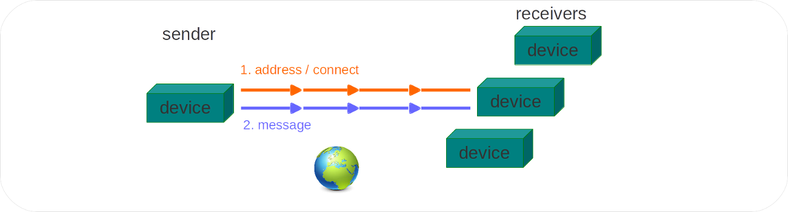
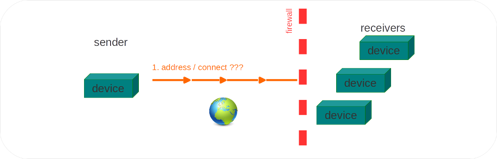
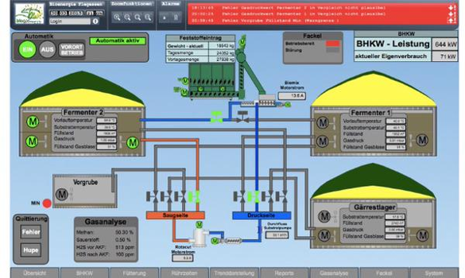
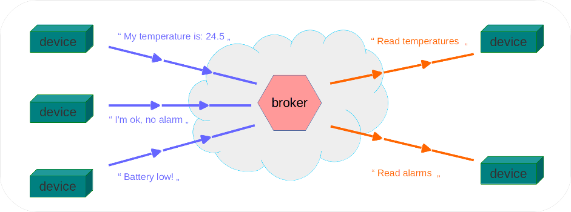
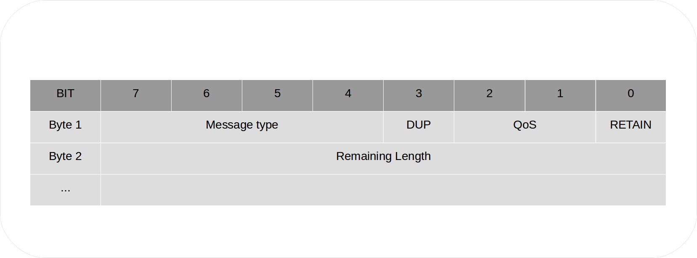
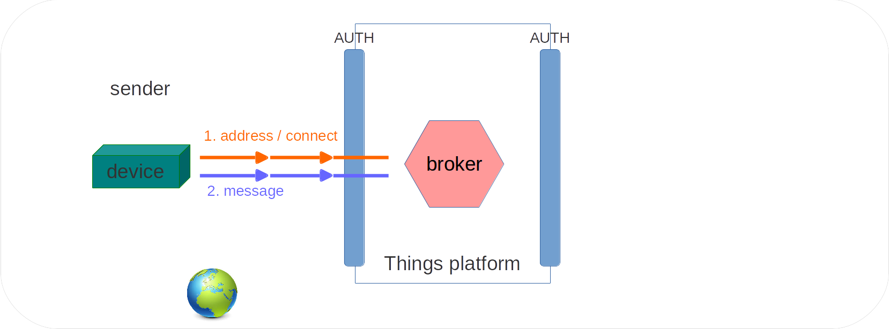
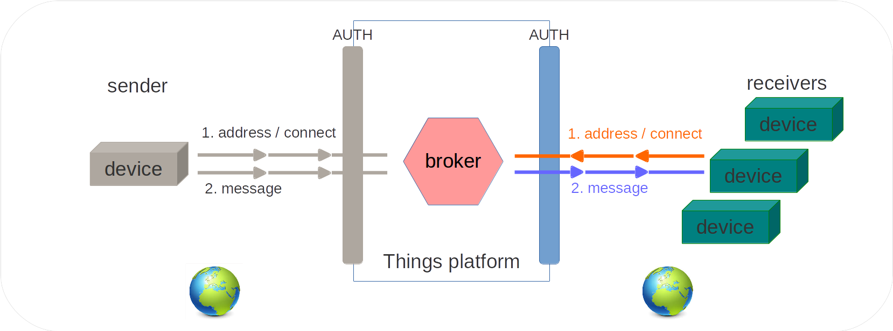

layout: true
.footer[
The Things platform at Bluewind
]

???
---

.left-column[
]

.right-column[
]

???
---

# Things

### Platform description

???
---

.left-column[
## "Things" can't communicate each other
]

.right-column[
*Things need to communicate each other using the Internet*

  - Small devices
  - Local computing
  - Visualization services
  - Mobile applications
  

]

???
---

.left-column[
## "Things" can't communicate each other
]

.right-column[
*Common scenario*

  - firewalls
  - NAT address translations
  - dynamic addresses behind routers
  - special local protocols routed to the Internet


]

???
---

.left-column[
## "Things" can't communicate each other
]

.right-column[
Security concerns make it difficult to imagine a different situation
even when the mentioned constrains can be avoided.



```
https://www.shodan.io/
```
]

???
---

.left-column[
## Introducing: Messaging protocols
]

.right-column[
*The only choice in so many situations*

It means: communication between two or more partners
is possible because a server in the middle accepts
and routes messages at the low level



Think of a *chat room for devices*.
]


???
---

.left-column[
## Messaging protocols advantages
]

.right-column[
Added value options rely exactly on the messaging architecture

- centralized accounting of traffic
- mass routing of messages
- authorization schemes
- backup and recovery
- scalable and modular services
]


???
---

  
.left-column[
## Introducing Things
]

.right-column[


http://things.bluewind.it
> Things is a service offered by Bluewind
]

???
---

.left-column[
## Meet Things
]

.right-column[
*Let's discover Things*

- *Things* is a messaging broker service
- enabling communication between end points
- in a secure and managed environment
- using a standard protocol.
]


???
---

.left-column[
## Meet Things
]

.right-column[
The architecture of *Things* perfectly suits a situation where
devices have a need for

- reliable
- medium to low volume
- secure

*communication* in the form of an exchange of messages
between each other and with a central service common to all of them.
]


???
---

.left-column[
## End points
]

.right-column[
End points are partners of communication (the flow of messages) in
the form of

- devices
- products
- servers
- computers
  
designed or prepared by the customer. They are referred to as
*devices* very often because this is the most common situation for IoT.
]

???
---

.left-column[
## End points
]


.right-column[
*More examples*

- a new product for home automation;
- an existing product for beverages vending with a retrofit design;
- a server on the cloud collecting messages;
- an in-house server collecting statistics;
- an app designed for modern smartphones.
]
  
???
---

.left-column[
## End points
]

.right-column[
*Devices* are designed and deployed by the customer.


Bluewind as a provider of technology
offers consultancy, design services, examples if requested.

???
---

.left-column[
## Messaging
]


.right-column[
- Communication between devices is performed by means of *messages*
- Any device enabled with *Things* protocols and services can
  very easily send and receive messages
- All messages flowing between devices are logged
  and saved on a private database residing on the *Things* cloud
- Messages are identified assigning them *topics*
- A topic is a *name* for a message, built following defined rules.
]

???
---

.left-column[
## Introducing: Broker
]

.right-column[
- Devices exchange messages without a direct connection
  between each other
- All devices connect directly to the *broker*
- The *broker* is a service (server, daemon)
  located at ***Things*** that route messages
  according to rules and configurations.
]

???
---

# Broker paradigm: advantages

  * Widely adopted architecture
  * All partners in communication need only to know
    the address and protocol of one single service, the *broker*.
  * Devices and Servers designed by the customer don't have any need for a
    direct mutual reachability on Internet
  * The only requirement is that devices can start a TCP connection
    to a public server on the Internet
  * From a logical point of view this makes it possible
    for all devicesto start sending and receiving messages
    between each other.

# Broker paradigm: other services

  * All messages exchanged are logged and saved in a database
  * Messages are always ready to be consumed by any application
  * Usual actions performed on stored messages: calculations,
    automation, alarms creation, visualization on a web panel

# Standard protocol: MQTT

***Things*** speaks the *MQTT* protocol

  * MQTT used externally between end points and the broker
    in most practical situations.
  * MQTT used internally between the services
  * Very easy to add any other protocol for special needs or
    compatibility with existing applications.
  * When a different protocol is needed an extension is developed
    that translates the information into MQTT messages

# Managed (1)

***Things*** platform is managed internally with automated tasks, and
from the customer point of view with a web administration panel.

# Managed (2)

The main automated tasks performed inside ***Things***

  * backup of databases
  * daemons status check
  * servers reachability from the Interner
  
# Managed (3)

Customers can use a web administration panel

  * list, view and export messages exchanged between end points
  * modify secrets
  * check and restart private daemons
  * modify republishing (tranformation) rules

# MQTT Protocol: description

The [MQ Telemetry Transport (MQTT)][8] protocol is a lightweight
publish/subscribe protocol over TCP/IP for remote devices through
low bandwidth, unreliable or intermittent communications.

MQTT is widely adopted in areas defined as

  * *The Internet of Things*
  * Applications where *simple devices and services
    need to communicate each other without human interaction*
    
# MQTT Protocol: history

  * MQTT has been developed and extensively described in a joint
    effort of Corporations like IBM and others
  * MQTT has been published and enhanced by a community of Open Source
    advocates
  * MQTT development lives now in the *Eclipse Foundation*
  * MQTT is being standardized by *Oasis*
  * *Oasis* defines itself as a *not-for-profit consortium
    devoted to promoting the adoption of Open Source standards
    and practices in all industries*.

# MQTT Protocol: features

As a general accepted definition contained in the Oasis documents
the protocol runs over TCP/IP, or over other network protocols
that provide ordered, lossless, bi-directional connections and
its features include:

  * Use of the publish/subscribe message pattern which provides
    one-to-many message distribution and decoupling of applications.
  * Transport of *messages* identified by *topics* organized in a
    hierarchy, much like *folders* in a filesystem.
  * A message can be any *blob* of bytes with a maximum length of 256Mb,
    no restriction applies to its content (binary data is accepted).
    In other words: the messaging transport is agnostic to the content
    of the payload.
  * Three qualities of service for message delivery:
    * "At most once", where messages are delivered according to
      the best efforts of the operating environment.
      Message loss can occur. This level could be used,
      for example, with ambient sensor data where it does
      not matter if an individual reading is lost as the
      next one will be published soon after.
    * "At least once", where messages are assured to arrive
      but duplicates can occur.
    * "Exactly once", where message are assured to arrive
      exactly once. This level could be used, for example,
      with billing systems where duplicate or lost messages
      could lead to incorrect charges being applied.
  * A small transport overhead and protocol exchanges minimized to
    reduce network traffic.
  * A mechanism to notify interested parties when an abnormal
    disconnection occurs.

The messages structure is very simple but the user has no need for
understanding the low level details since plenty of implementations
and examples exist for virtually all useful platforms and languages,
starting from reference libraries found at the
[Eclipse Foundation Paho repositories][10].



# MQTT Protocol: topics and messages in practice


# MQTT Protocol: secure transport

Messaging solutions for devices are often deployed in hostile
communication environments. Internet by itself is considered highly
hostile and insecure, not to mention local unreliable communication
channels and networks such as radiofrequency links found on home
automation and industrial applications.

When it comes to communication between objects without human
interaction, security is an order of magnitude more difficult to be
achieved because it's often the case that automatic and repeated
processes are very easily interpreted and break by evil
entities. Several examples of such situations are linked here as
references:

  * [breaking a fitness device][12]
  * [breaking a car tracking device][13]
  * [common faults while deploying authentication passwords][14]

In such cases it is advisable to implement proven standards for:

  * *authentication* of Clients by the Server
  * *authentication* of Server by Clients
  * *authorization* of access to Server resources
  * *integrity* of protocols Control Packets and
    application data contained therein
  * *privacy* of protocols Control Packets and
    application data contained therein

Stated in official documentation:

>As a transport protocol, MQTT is concerned only with message
>transmission and it is the implementer’s responsibility to
>provide appropriate security features. This is commonly
>achieved by using TLS (RFC5246).

***Things*** as a company policy uses Open Source implementations of
both the MQTT Broker and TLS v1.2 secure transport, being convinced as a
general rule that publicly available software implementations of
protocols and algorithms are the best approach to an acceptable measure
of privacy and security.

Several different implementation details are available and activated
under request.

# Things: services description

***Things*** refers to a set of services running
on an array of cloud located servers, offered by Bluewind
with a simple pay as you go contract.

It gives scalable features to subscribed users and is composed of
modules and extensions.


***Things*** enables products designed by customers to send, store,
retrieve and organize messages in a secure and managed environment.
Messages are known inside ***Things*** with a defined syntax and
flow to and from the products by means of a standard default protocol
if available, or any user defined protocol that translates into
its context using extensions.

Modules available on ***Things*** are:

  * messaging broker
  * messages persistent storage
  * messages republishing engine
  * user and devices authentication service
  * web based administration and monitoring

Extensions that can be added to *Things* on request are:

  * protocol translators
  * web data presentation

# How messages get into ***Things***

End points enabled for ***Things*** would typically speak the MQTT
protocol; this means that sending a message to the platform is done
by using MQTT and authentication information given when subscribing
to the service.



Each single message is sent to ***Things*** with a very simple
operation from the software point of view. The direct destination of
each message is the broker, while the logical destination can be
any end point that meets three requirements:

  * connects to ***Things*** with the same authentication
    information (belongs to the same account);
  * speaks MQTT;
  * is subscribing to the same message topic in the meaning of MQTT.

In other words: each end point decides that it's interested at listening
to a message topic, and will receive any message being sent
by any other end point named after that topic.

# How messages get out of ***Things***

As already mentioned, messages with a certain topic leave ***Things***
to reach all end points that are interested at that same topic and
speak MQTT. This is the intended behaviour for real time messaging
among devices and applications, one of the foundations of the 
Internet of Things semantic.



Please go through [Persistence](#Persistence) below for a different
delivery of messages.

# Transformations of messages in ***Things***

While building services on top of communication between devices it's
often very handy to have the possibility of transforming messages
following defined rules.

This service is enabled for all customers on the broker. The customer
defines rules on his web administration panel, and messages delivered by
the broker will also be processed by those rules.

Rules are written in a syntax common to the Ruby programming language.
They can perform generic string search and substitution, new topic
creation, new message creation from parts of existing messages.


Transformations are not time related: messages are processed by the
transformation service in realtime while being delivered by the broker
and there is no availability of such functions like delays or triggers.

# Persistence of messages in ***Things***

Messages sent through ***Things*** are optionally processed by a special
service and saved to a database private to the customer.

The database contains reference to topics and messages and each saved
message is timestamped to milliseconds. The customer has an option to
securely connect to the database (MySQL native protocol) and obtain
records by querying with the standard SQL language.


This is the preferred model for business where the customer needs to
build a web presentation service on top of data coming from devices,
and does not want to learn and manage MQTT or any other special
protocol.

# Reference links

### Articles

  * [HiveMQ Essentials][15]
  * [Internet of Things explained][16]
  * [Origin of MQTT (1)][17]
  * [Origin of MQTT (2)][18]

### Competitors

  * [ThingSpeak][1]
  * [Xively by LogMeIn][2]
  * [CloudMQTT][3]
  * [2lemetry][4]
  * [Solair][5]
  * [Sentilo][6]


[1]:https://thingspeak.com/ "ThingSpeak"
[2]:https://xively.com/ "Xively by LogMeIn"
[3]:http://www.cloudmqtt.com/ "CloudMQTT"
[4]:http://2lemetry.com/ "2lemetry"
[5]:https://www.solaircorporate.com/ "Solair"
[6]:http://www.sentilo.io/ "Sentilo"
[7]:https://www.oasis-open.org/committees/tc_home.php?wg_abbrev=mqtt "Oasis MQTT Committee"
[8]:http://mqtt.org/ "MQTT"
[9]:http://www.redbooks.ibm.com/Redbooks.nsf/RedpieceAbstracts/sg248228.html "MQTT at IBM"
[10]:https://eclipse.org/paho/ "MQTT at Eclipse"
[11]:http://docs.oasis-open.org/mqtt/mqtt/v3.1.1/os/mqtt-v3.1.1-os.html "Oasis MQTT Description"
[12]:http://www.evilsocket.net/2015/01/29/nike-fuelband-se-ble-protocol-reversed/ "Breaking a fitness device"
[13]:http://www.forbes.com/sites/thomasbrewster/2015/01/15/researcher-says-progressive-insurance-dongle-totally-insecure/ "Breaking a car tracking device"
[14]:https://crackstation.net/hashing-security.htm "Secure salted passwords"
[15]:http://www.hivemq.com/blog/ "HiveMQ blog series"
[16]:https://www.bbvaopenmind.com/en/internet-of-things-iot-the-third-wave/ "Internet of Things"
[17]:http://bits.blogs.nytimes.com/2013/04/25/a-messenger-for-the-internet-of-things/ "Origin of MQTT"
[18]:http://www.computerworld.com/article/2496621/emerging-technology/the-internet-of-things-gets-a-protocol----it-s-called-mqtt.html "Origin of MQTT"


???
---

## Any Question?

Let's keep in touch!

mail: stefano.costa@bluewind.it

twitter: @stefanobluewind

company: www.bluewind.it
